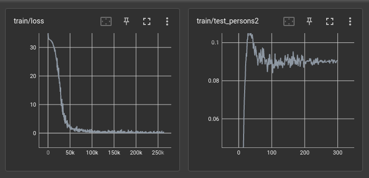
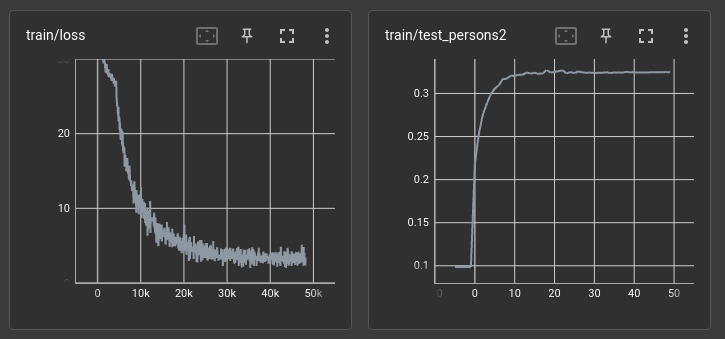

# DINO RECOGNITION

## Usage
- Step1: Set parameters in cfg_dino.yaml, use train_dino.py for unsupervised learing. example: bash train.sh 0,1,2,3 4 train_dino.py
- Step2: Set parameters in cfg_recog.yaml, use train_recog.py for supervised learging. example: bash train.sh 0,1,2,3 4 train_recog.py

### Person Reid Result
- Market-1501: 28,849
- MSMT17: 112,217
- luperson: 10,683,279

