# DINO RECOGNITION

## Usage
- Step1: Set parameters in cfg_dino.yaml, use train_dino.py for unsupervised learing. example: bash train.sh 0,1,2,3 4 train_dino.py
- Step2: Set parameters in cfg_recog.yaml, use train_recog.py for supervised learging. example: bash train.sh 0,1,2,3 4 train_recog.py

### Person Reid Result
- Market-1501: 28,849
- MSMT17: 112,217
- luperson: 10,683,279

## Methods

### Softmax with Cross Entropy Loss
#### $$ S_j = \frac{exp(z_j)}{\sum_{k=1}^N exp(z_k)} $$
#### $$ L = - \sum_{j=1}^N y_j\log{s_j} $$
#### $$ = -\log{s_j} $$
- $N$：class number
- $y_j$：label

### Triplet Loss

#### $$ L = \sum_i^N[||f(x_i^a) - f(x_i^p)||_x^2 - ||f(x_i^a) - f(x_i^n)||_2^2 + \alpha]_+ $$

## Additive Margin Softmax (CosFace)
#### $$ L_{AMS} = -\frac{1}{n}\sum_{i=1}^n\log\frac{exp(s\cdot(\cos\theta_{y_i} - m))}{exp(s\cdot(\cos\theta_{y_i} - m)) + \sum_{j=1,j\neq y_i}^c exp(s\cdot\cos\theta_j)} $$ 
#### $$ = -\frac{1}{n}\sum_{i=1}^n\log\frac{exp(s\cdot(W_{y_i}^T f_i - m))}{exp(s\cdot(W_{y_i}^T f_i - m)) + \sum_{j=1,j\neq y_i}^c exp(s\cdot(W_j^T f_i))} $$
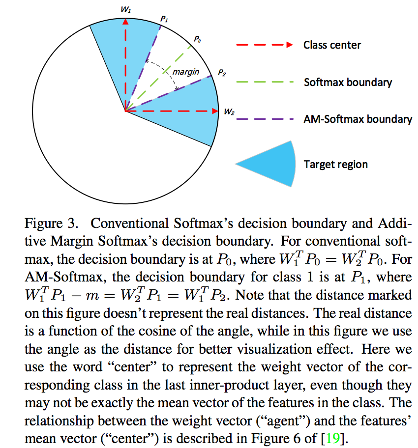

### Knowledge Distillation
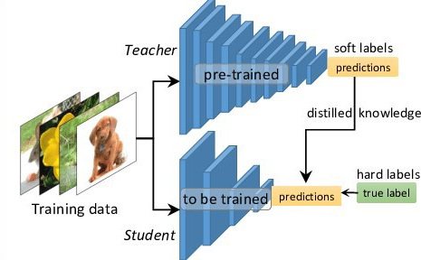
#### $$ L = CE(y, p) + \alpha CE(q, p) $$
#### $$ q_i = \frac{exp(z_i/T)}{\sum_j exp(z_j/T)} $$

### Self Supervised
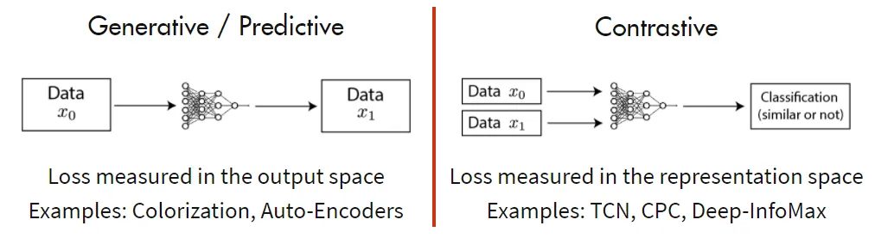

### SimCLR: a simple framework for contrastive learning of visual representations
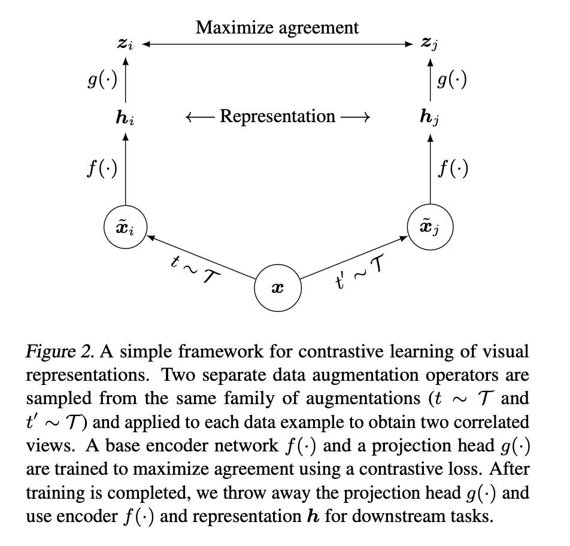
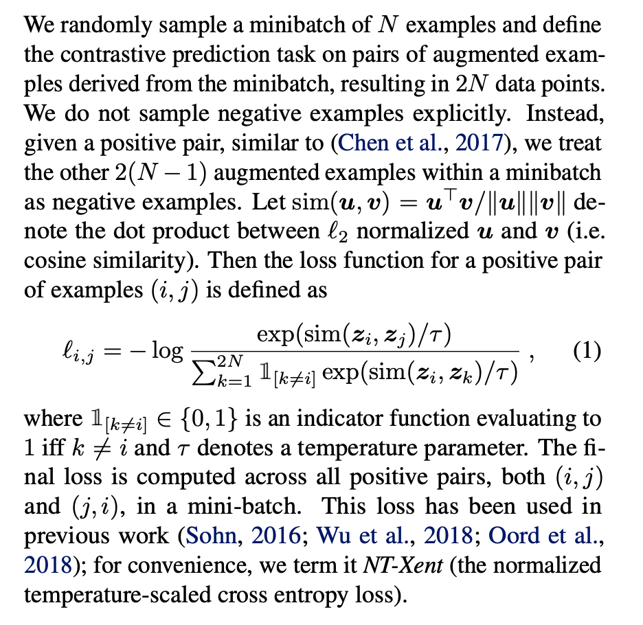
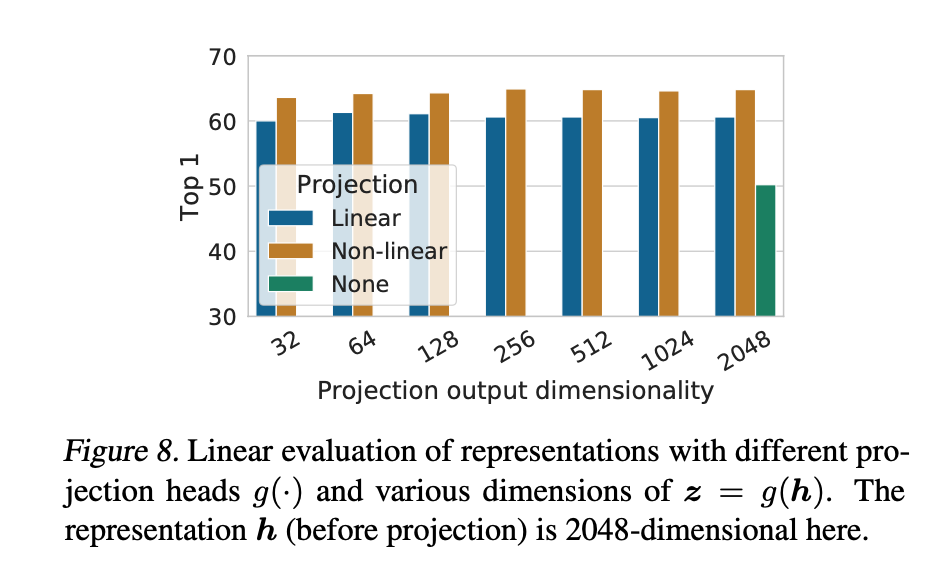

### MOCO: momentum contrast for unsupervised visual representation learning
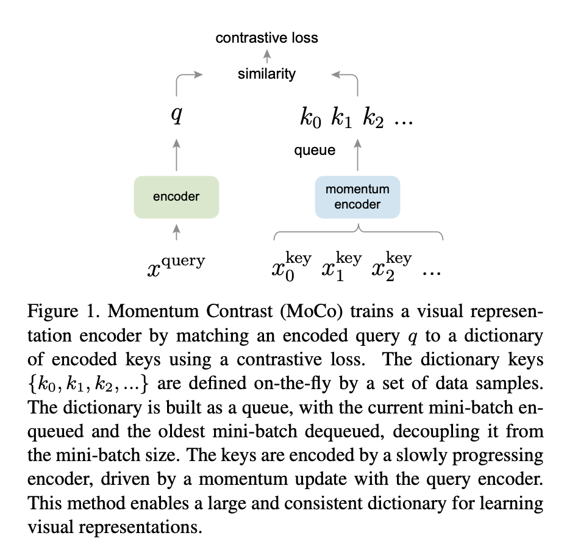
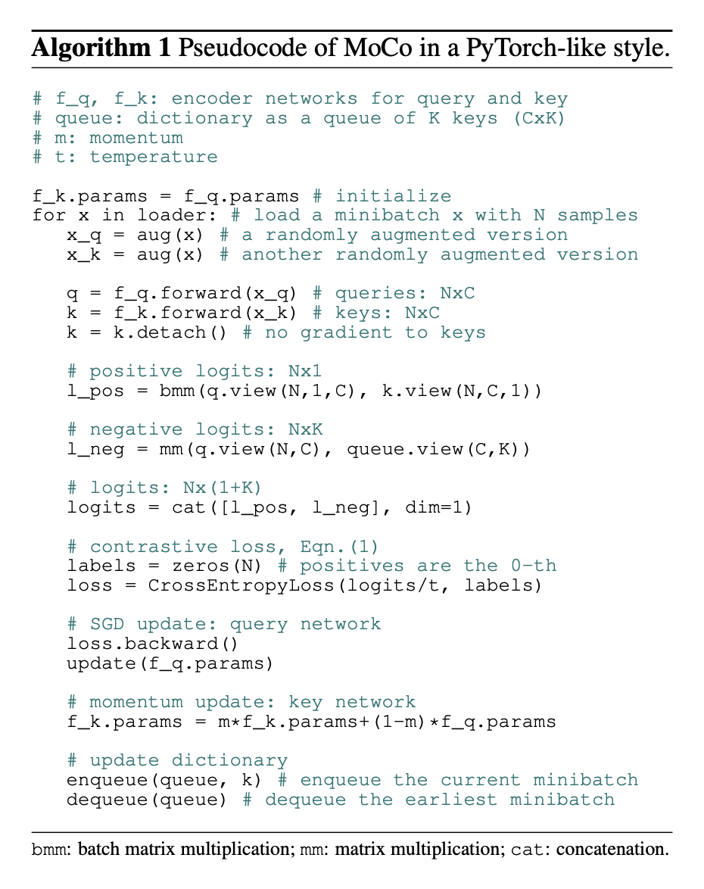

### MOCOv2
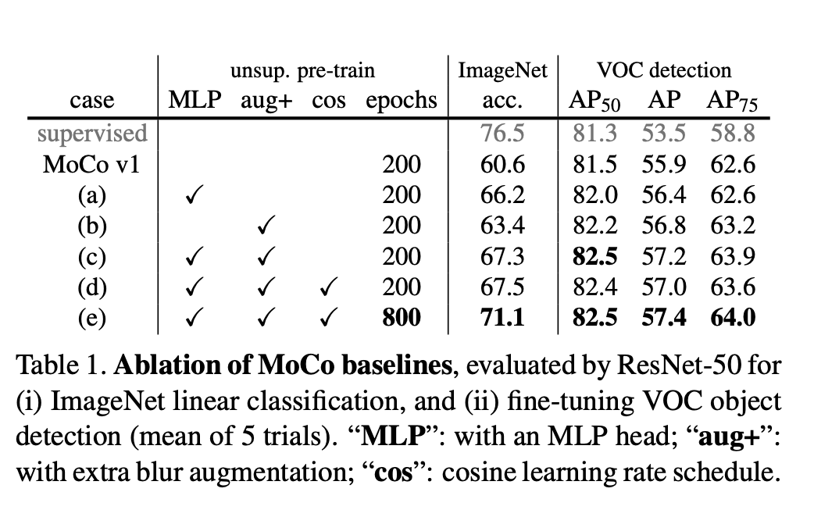

### MOCOv3

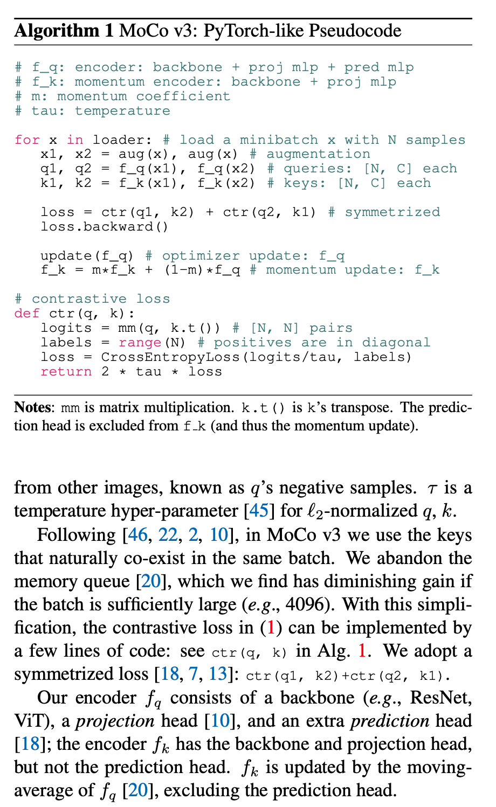

### Dino: self-distillation with no labels
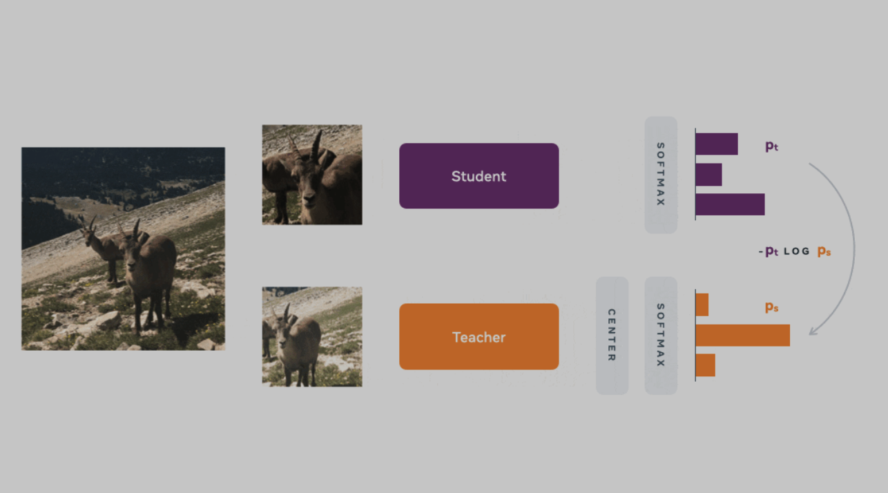
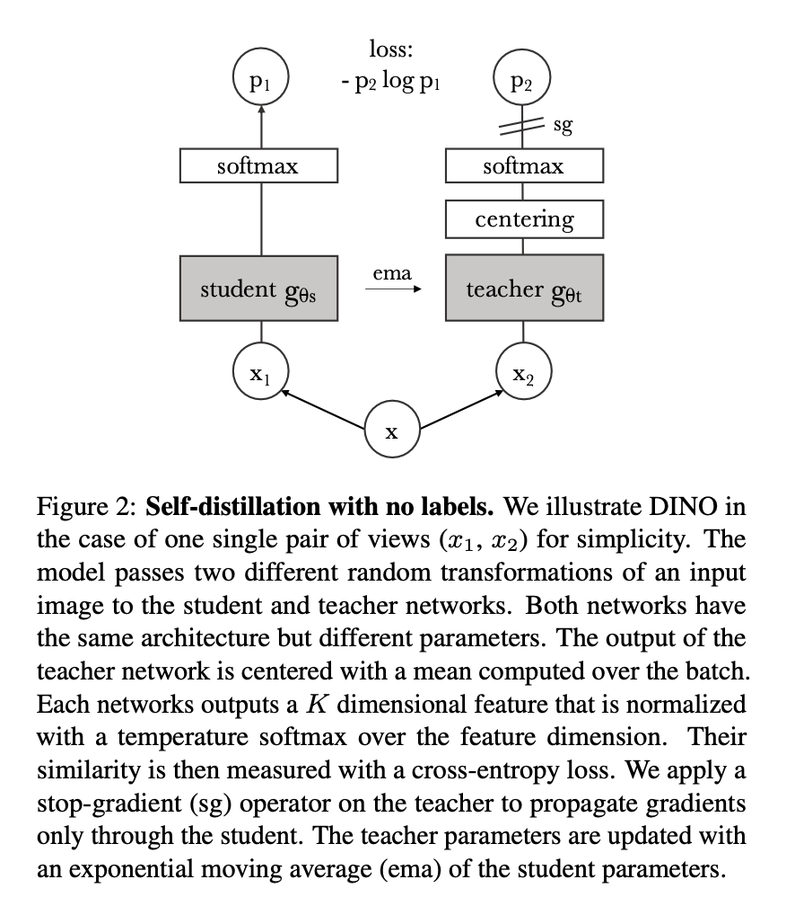
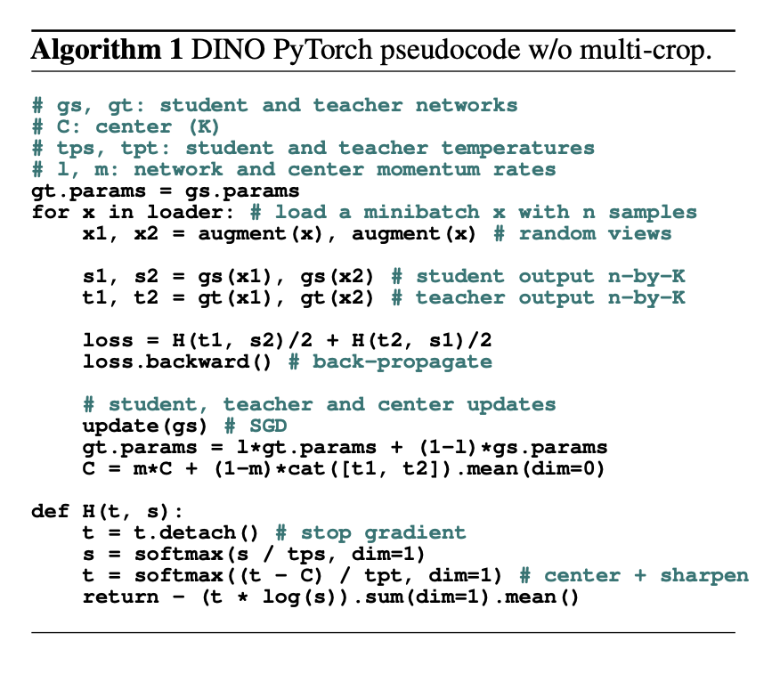

### Beit: BERT Pre-Training of Image Transformers
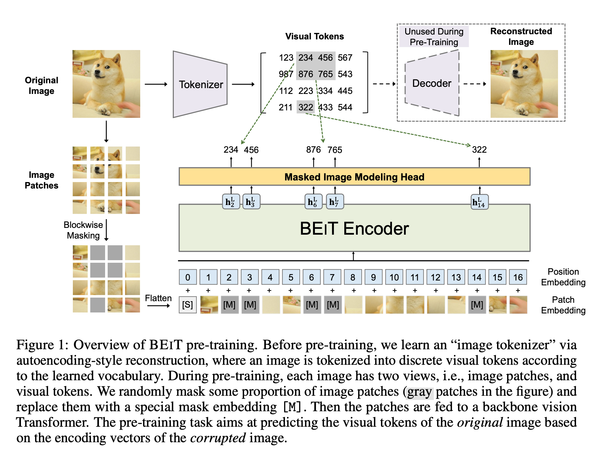

### IBOT: Image BERT Pre-Trainig with Online Tokenizer
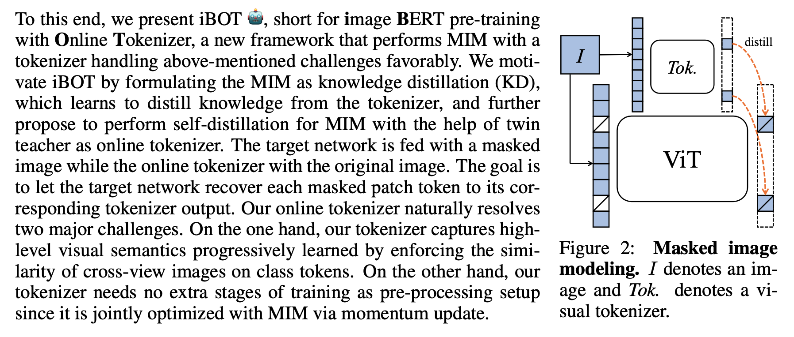

### Dinov2: Learning Robust Visual Features without Supervision
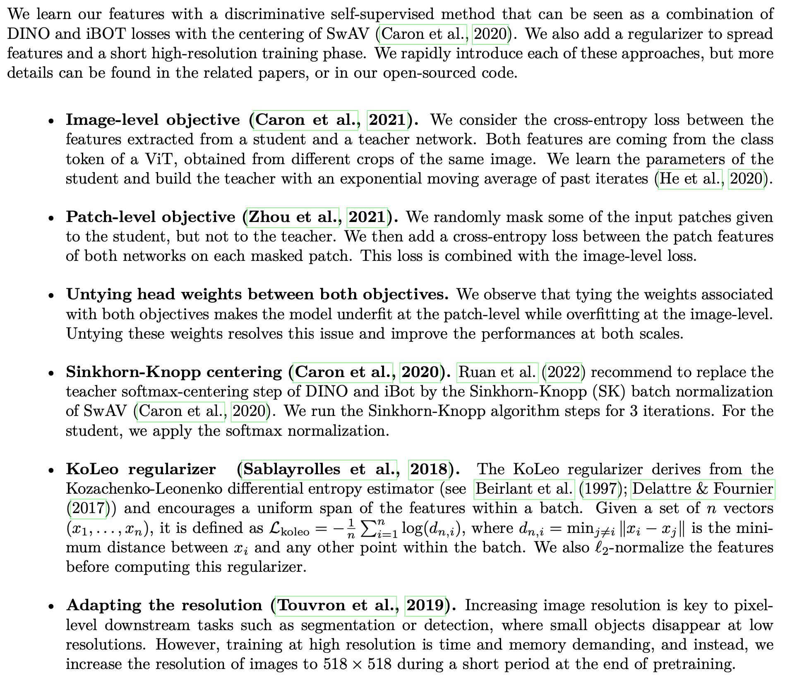

### Reference
- [FaceNet: Triplet Loss (2015)](https://arxiv.org/pdf/1503.03832.pdf)
- [CenterLoss (2016)](http://ydwen.github.io/papers/WenECCV16.pdf)
- [NormFace (2017)](http://www.cs.jhu.edu/~alanlab/Pubs17/wang2017normface.pdf)
- [L-Softmax (2016)](http://proceedings.mlr.press/v48/liud16.pdf)
- [A-Softmax (2017)](https://arxiv.org/pdf/1704.08063.pdf)
- [AM-Softmax (2018)](https://arxiv.org/pdf/1801.05599.pdf)
- [ArcFace (2018)](https://arxiv.org/pdf/1801.07698v1.pdf)
- [AdaFace (2022)](https://arxiv.org/abs/2204.00964)
- [Partial FC (2022)](https://arxiv.org/abs/2203.15565)
- [Distilling (2015)](https://arxiv.org/abs/1503.02531)
- [SimCLR (2020)](https://arxiv.org/abs/2002.05709)
- [MOCOv1 (2020)](https://arxiv.org/abs/1911.05722)
- [MOCOv2 (2020)](https://arxiv.org/abs/2003.04297)
- [MOCOv3 (2021)](https://arxiv.org/abs/2104.02057)
- [DINOv1 (2021)](https://arxiv.org/abs/2104.14294)
- [Beit (2021)](https://arxiv.org/abs/2106.08254)
- [IBOT (2021)](https://arxiv.org/abs/2111.07832) 
- [DINOv2 (2023)](https://arxiv.org/abs/2304.07193)
  